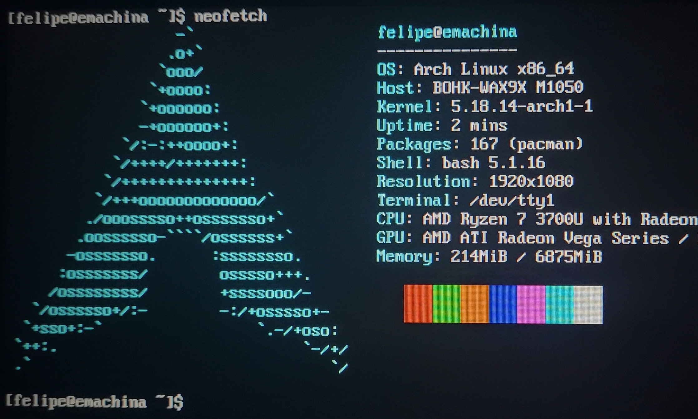

# Keyboard layout and time
## 1.  Setting up keyboard layout (Latin American distribution):
```bash
loadkeys la-latin1
```

## 2. Synchronising system time:
```bash
timedatectl set-ntp true
```

# Wireless connection
## 3. Checking WiFi interface status:
```bash
ip link set wlan0 up
```

## 4. Generating WiFi configuration file:
```bash
wpa_passphrase NetworkName PASSWORD > /etc/wifi
```
 
## 5. Starting connection with the generated file in previous step:
```bash
wpa_supplicant -B -i wlan0 -D wext -c /etc/wifi
```

## 6. Obtaining IP address from DHCP server:
```bash
dhclient	
```

# Partitions
## 7.  Listing current disk partitions:
```bash
fdisk -l
```

## 8.  Accessing to the found disk with cfdisk, which is an interactive partition binary:
```bash
cfdisk /dev/nvm0n1
```

## 9. Partitions table sample (EFI Systems):
```bash
   DEVICE	SIZE	  TYPE
/dev/nvme0n1p1	512M	EFI System
/dev/nvme0n1p2	7G	Linux swap
/dev/nvme0n1p3	80G	Linux root (x86-64)
/dev/nvme0n1p4	XG	Linux home
```

## 10. Formatting partitions:
```bash
Boot/Efi System		mkfs.vfat -F32 /dev/nvme0n1p1
Linux root (x86-64)	mkfs.ext4 /dev/nvme0n1p3
Linux home		mkfs.ext4 /dev/nvme0n1p4
Linux swap		mkswap /dev/nvme0n1p2
```

## 11.  Switching on Swap partition:
```bash
swapon /dev/nvme0n1p2
```

# Mounting system
## 12.  Creating  and mounting boot and home partitions on folders:
```bash
mkdir /mnt/boot
mkdir /mnt/home
```

```bash
mount /dev/nvme0n1p1 /mnt/boot
mount /dev/nvme0n1p3 /mnt
mount /dev/nvme0n1p4 /mnt/home
```

# Essentials configurations
## 13.  Installing base software:
```bash
pacstrap /mnt base linux linux-firmware
```
## 14.  Generating File System Table:
```bash
genfstab -U /mnt >> /mnt/etc/fstab
```
## 15.  Verify the file has been successfully generated:
```bash
cat /mnt/etc/fstab
```
## 16. Move to /mnt directory as root user:
```bash
arch-chroot /mnt
```

## 17. Check on /boot directory to check if the EFI image exists:
```bash
la /boot
```

## 18. Configuring localtime and zone information:
```bash
ln -sf /usr/share/zoneinfo/Continent/City /etc/localtime
```

## 19.  Synchronising hardware clock (RTC - Real Time Clock) with the operating system clock:
```bash
hwclock --systohc
```

## 20.  Modifying locale.gen file to enable the languages to use on the system:
```bash
nano /etc/locale.gen
```

### For english (US) and spanish (CO) uncomment the following lines:
```bash
en_US.UTF-8 UTF-8
es_CO.UTF-8 UTF-8
```

## 22.  Generating local configuration and preferences based in the applied changes in previous step:
```bash
locale-gen
```

## 23.  Defining and exporting language and keyboard layout to respective configuration files:
```bash
echo "LANG=es_CO.UTF-8" > /etc/locale.conf
```

```bash
echo "KEYMAP=es" > /etc/vconsole.conf
```

## 24. Defining the hostname of the system:
```bash
echo "NAMEOFTHEHOST" > /etc/hostname
```

## 25.  Modifying hosts file to set the hostname variable as localhost:
```bash
nano /etc/hosts
```

```bash
127.0.0.1	localhost
::1		localhost
127.0.1.1	NAMEOFTHEHOST.localhost NAMEOFTHEHOST   ==> example:		unicorn.localhost unicorn
``` 
## 26. Setting a password for root user:
```bash
passwd
```

## 27. Installing a binary to manage network connections (necessary to facilitate the WiFi connection after restarting the system):
```basg
pacman -S networkmanager
```

## 28. Enabling the installed service to use it later:
```bash
systemctl enable NetworkManager
```

# Grub related procedure
## 29. Installing grub and efiboot manager:
```bash
pacman -S grub efibootmgr
```

## 30. Installing grub on /boot directory:
```bash
grub-install --target=x86_64-efi --efi-directory=/boot
```

**IMPORTANT**
Do not forget to specify the architecture of your machine!

## 31. Exporting grub configuration to a file:
```bash
grub-mkconfig -o /boot/grub/grub.cfg
```

# Users and groups
## 32.  Creating username with -m flag to specify the creation of the user folder on /home
```bash
useradd -m randomUsername
```

## 33.  Setting a password for the created user:
```bash
passwd randomUsername
```

## 34. Including user in essential groups:
```bash
usermod -aG wheel,video,audio,storage randomUsername
```

## 35. Installing sudo binary to manage privileged actions in a controlled way:
```bash
pacman -S sudo
```

## 36. Giving to the created user the privilege to run sudo as super administrator:
```bash
nano /etc/sudoers
```

### Uncomment the following line:
```bash
%wheel ALL=(ALL) ALL
```

## 38. Move to the user account to check if it was added successfully and you're part of the groups you mentioned in previous steps:
```bash
su randomUsername
```

```bash
groups
```

# Concluding
## 39. Exit from the current user account and the created filesystem:
```bash
exit
```

```bash
exit
```

## 40. Now, from the ISO console, unmount /mnt directory (where our system is mounted):
```bash
umount -R /mnt
```

## 41. Shutdown operating system:
```bash
shutdown now
```

**IMPORTANT** 
Remove the USB once the system is off, then you can turn on the machine.

